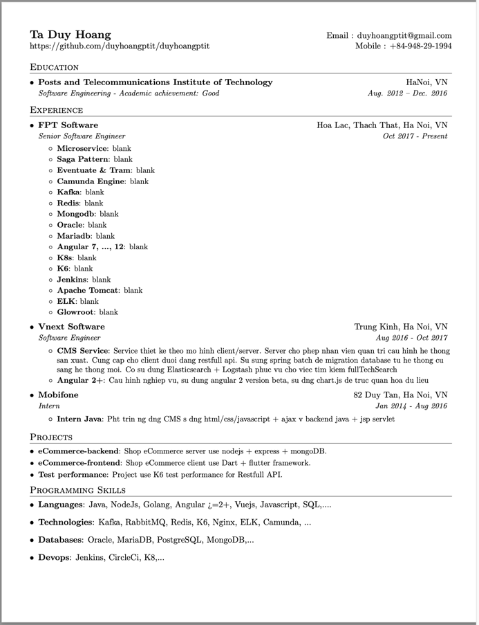

<h1 align="center">Hi 👋, I'm Hoang Ta Duy</h1>
<h3 align="center">A self-taught programmer and born at very little age😜</h3>

- 🔭 I’m currently working in company https://www.fpt-software.com/

- 🌱 I’m currently learning **Flutter, Ios, English...**

- 👯 I’m looking to collaborate with **other content creators**

- ⚡ Fun fact **I love to play Soccer and Chai over coffee.**

### Connect with me:

 

### Languages

 Java
 NodeJS
 Golang
 C & C++
 Javascript
 Angular >=2+
 VueJS
 Flutter

### Technologies
 Kafka
 RabbitMQ
 K6
 Nginx
 ELK
 Camunda
 MinIO ~ S3

### Databases
Oracle
MariaDB
Postgresql
MongoDB

### Devops
 Jenkins
 CircleCi
 K8

### Most Used Languages

 
 
 
 
 
 
 
 

### GitHub Stats

&nbsp;

### Preview

